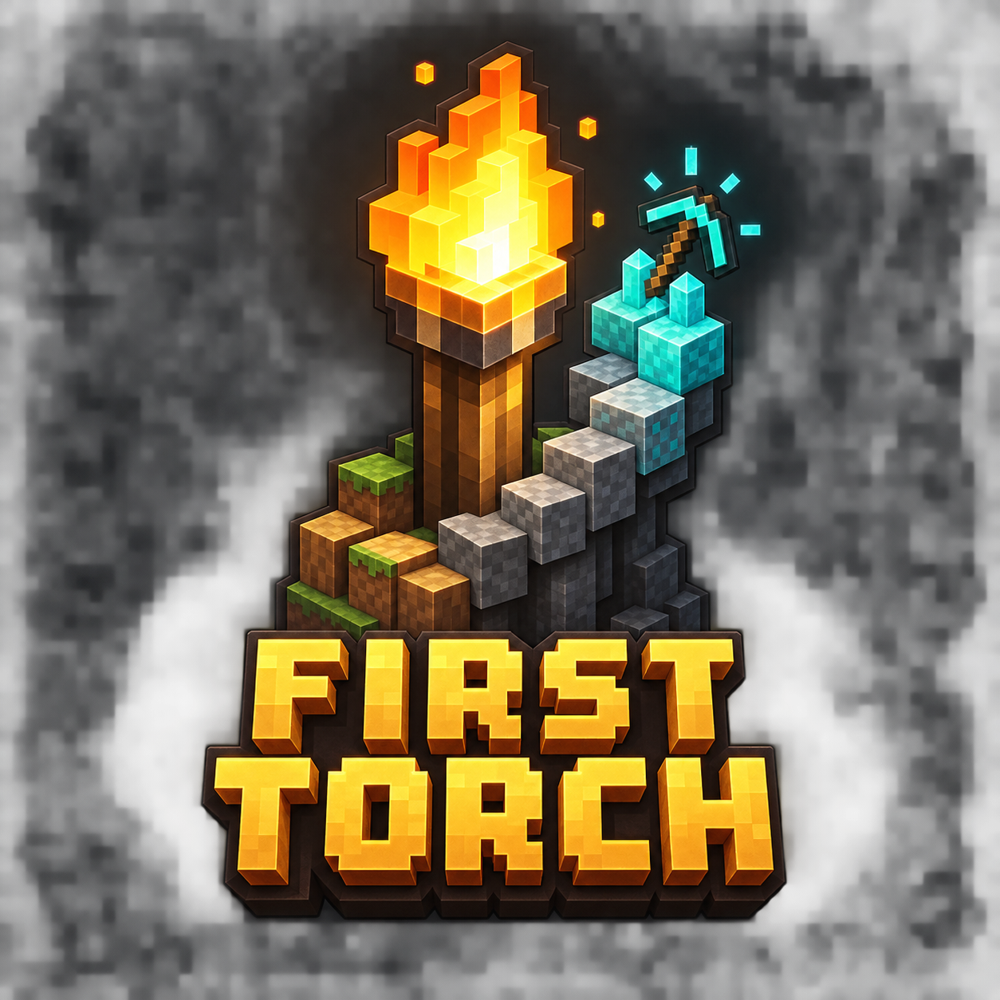

# First Torch



**A patient, step-by-step Minecraft survival course inside the game.**

First Torch is an independent NeoForge mod. The next development milestone is 0.14.0; the previous release line is 0.13.0-beta.2. It teaches what to do, why it matters, and how to practise safely. Its native runtime does not require FTB Quests, FTB Library, FTB Teams, their filter modules, Initially, or DistinctCraft.

## Current target

- Native mod: `0.14.0-alpha.1`
- Minecraft Java: `26.1.2`
- Tested NeoForge: `26.1.2.84`
- Java toolchain: `25`
- Languages: English (`en_us`) and German (`de_de`)

The guided course covers early survival through the Nether, End and independent exploration, with optional Redstone lessons. The separate reference library covers creatures and unusual mechanics. Native features include automatic/manual tasks, rewards, trophies, search, original-game illustrations and returnable reading links.

LAN multiplayer smoke tests are accepted; dedicated-server testing is explicitly out of the current scope and dedicated-server operation remains unverified. See the concise [changelog](CHANGELOG.md), [release upload notes](docs/CurseForgeUpload.md), and [licensing review](docs/ReleaseLicensing.md).

The shared quest core now targets Java 21 in preparation for Minecraft 1.21.1. The playable runtime still targets **26.1.2 only**; this development build is not a completed 1.21.1 backport. See [the backport assessment](docs/Backport1211.md).

## Develop in IntelliJ IDEA

Import this repository as a Gradle project and use **First Torch Client**, or run:

```powershell
.\gradlew.bat runClient
```

The development run enables the left-two-thirds window layout. Design-preview switching and test-completion bypasses are retired, including in development launches.

## Build and install the native development version

```powershell
.\gradlew.bat test build
```

Output: `build/libs/firsttorch-mc26.1.2-0.14.0-alpha.1.jar`.

1. Use a separate Minecraft **26.1.2** profile with NeoForge **26.1.2.84** and a compatible Java 25 runtime.
2. Close Minecraft. Back up existing test worlds before changing installed mods.
3. Place the JAR in that profile's `mods` folder. Keep only one First Torch version installed; do not remove unrelated mods.
4. Start a fresh test world. Open First Torch with the key directly below Escape and left of 1, or through its pause-menu entry. Remap the key in Controls if needed.
5. Once references unlock, the Bookshelf icon opens the reference library. No physical quest-book item is needed.

Illustrations and translations are included in the native JAR; no separate First Torch guide resource pack is needed. Progress belongs to the world/player, not the JAR.

## Support and contact

Send feedback, bug reports, questions, or ideas through the English
[KohakuD Mod Contact & Feedback form](https://docs.google.com/forms/d/e/1FAIpQLSee3Rtf4uvSOGDUpd_bGpUMKWNM90tvHh15vOi5UA3tLneGuA/viewform?usp=publish-editor).
The form also supports DistinctCraft and Living Paths. Voluntary support is
available through [Buy Me a Coffee](https://buymeacoffee.com/KohakuD).
Technical issues can also be reported through
[GitHub Issues](https://github.com/KohakuD/MCFirstTorch/issues).

## Historical FTB pack

The discontinued FTB-based pack is retained for historical reference under [`archive/ftb-legacy/`](archive/ftb-legacy/). It is not part of the active build, installation process, or development workflow. First Torch does not provide and does not plan an FTB progress importer.

The archive contains a frozen, runnable legacy pack snapshot, including its manifest, overrides, tools, and documentation. It is unsupported and must not be treated as a native release artifact.

## Development references

- [Development workflow](docs/Development.md)
- [Curriculum principles](docs/Curriculum.md)
- [Roadmap](docs/Roadmap.md)
- [Changelog](CHANGELOG.md)

Generated builds, worlds, logs and player data do not belong in Git.

## Licence and trademarks

First Torch code and text use [MIT](LICENSE-CODE); original visual assets use [CC BY 4.0](LICENSE-ASSETS.md). See [LICENSE](LICENSE) and [NOTICE.md](NOTICE.md) for scope and third-party exclusions. Minecraft is a trademark of Microsoft. This project is not affiliated with Mojang Studios, Microsoft, CurseForge, or NeoForged.
